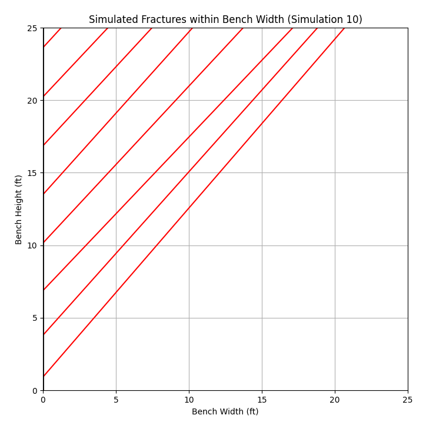
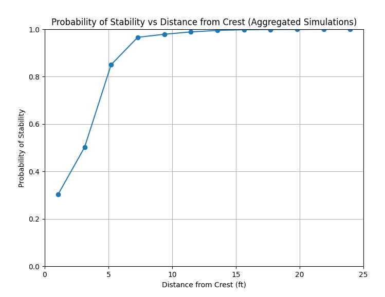
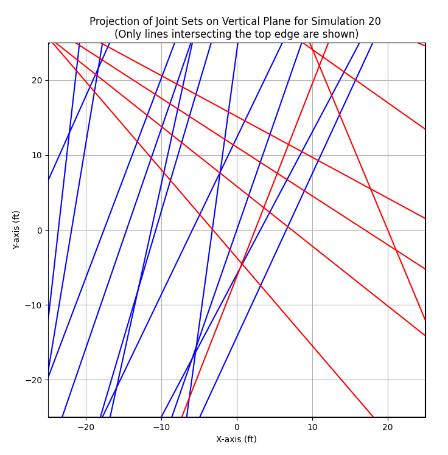
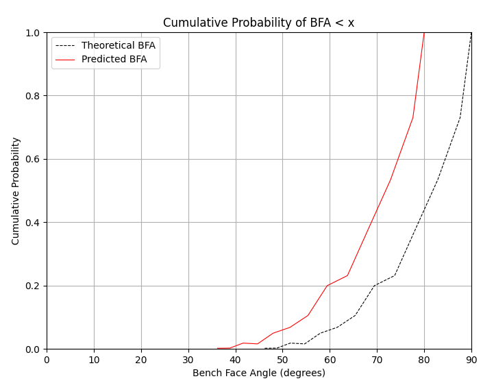

# Backbreak-Open-Pit-Bench-Stability

**Probabilistic analysis of wedge and planar failures**

## Overview

This repository provides a set of Python scripts designed to simulate and analyze wedge and planar failures in open-pit mining, with a focus on bench stability. The project implements probabilistic methods to evaluate the factor of safety (FOS), probability of failure (PoF), and probability of stability (POS) for various failure scenarios.

The repository includes:
- **Planar Failure Simulation**: Focused on backbreak and stability analysis.
- **Wedge Failure Simulation**: Models wedge formation from joint plane intersections.
- **Combined Failure Mode Analysis**: Combines the outputs of planar and wedge failure models for a comprehensive stability analysis.

## References

Based on interpretations of the following documents:

  NIOSH [2007]. A user's guide for the Bplane, Bstepp, and Bwedge computer programs.
  NIOSH Information Circular (IC) 9494. By Miller S, Whyatt J, Dwyer JG, McHugh E. Spokane,
  WA: U.S. Department of Health and Human Services, Public Health Service, Centers for
  Disease Control and Prevention, National Institute for Occupational Safety and Health, DHHS
  (NIOSH) Publication No. 2007–108. 

  Miller, S.M., Girard, J.M., and McHugh, E. (2000). Computer modeling of catch benches to mitigate rockfall hazards in open pit mines. Pacific Rocks 2000, Balkema, Rotterdam, pp. 539-545.

Wedge Solution is from:
  Hoek, E. and Bray, J.W. (1981). Rock Slope Engineering, Revised 3rd edition, The Institution of Mining and Metallurgy, London, pp 341 - 351.


## Features

- **Planar and Wedge Simulations**: Separate scripts to simulate and analyze both failure modes.
- **Joint Probability of Failure**: A combined analysis that integrates planar and wedge failure results to compute joint probabilities.
- **Visualization Tools**: Functions to visualize the probability of stability, wedge formation, and cumulative probability of bench face angle (BFA).

## Project Structure

### 1. **Planar Failure Simulation**
   The planar failure simulation uses probabilistic methods to simulate fracture propagation. It calculates the probability of sliding, fracture length exceedance, and overall stability.

   - **Main Script**: `pyplane.py`
   - **Key Functions**:
     - `simulate_fracture()`: Simulates fracture distribution and calculates stability.
     - `process_simulations()`: Runs multiple simulations and aggregates results.
     - `plot_probability_of_stability()`: Plots the aggregated probability of stability vs. distance from crest.
     - `plot_fractures()`: Visualizes fracture geometries in the bench.

   - **Output**:
     - A CSV file (`pyplane_out.csv`) containing simulation results.
     - Visualizations of stability probability and fracture geometry.

### 2. **Wedge Failure Simulation**
   The wedge failure simulation models wedge formation caused by joint plane intersections. The script computes wedge geometry, factor of safety (FOS), and probability of sliding (PoS).

   - **Main Script**: `pywedge.py`
   - **Key Functions**:
     - `generate_joint_planes()`: Generates joint planes based on mean dip and dip direction.
     - `generate_intersections()`: Finds intersections between joint planes and the bench face.
     - `compute_factor_of_safety()`: Calculates FOS and probability of failure for wedges.
     - `process_dataframe()`: Processes wedge intersection points and evaluates stability.

   - **Output**:
     - A CSV file (`pywedge_out.csv`) with wedge failure simulation results.
     - Visualizations of FOS and probability of sliding.

### 3. **Combined Failure Mode Analysis**
   The combined analysis computes the joint probability of stability by integrating results from both planar and wedge failure simulations.

   - **Main Script**: `bfcom.py`
   - **Key Functions**:
     - `joint_pof`: Computes the joint probability of failure by combining planar and wedge failure probabilities.
     - `plot_cumulative_bfa()`: Visualizes the cumulative probability of bench face angle (BFA).
   
   - **Output**:
     - A CSV file (`combined.csv`) and plots of the joint probability of stability vs. distance from crest, and the cumulative probability of BFA.

## How to Use

### 1. Clone the repository
```bash
git clone https://github.com/yourusername/Backbreak-Open-Pit-Bench-Stability.git
cd Backbreak-Open-Pit-Bench-Stability
```

### 2. Install dependencies
The project requires the following Python libraries:
- `numpy`
- `pandas`
- `matplotlib`

Install the dependencies using:
```bash
pip install -r requirements.txt
```

### 3. Run the simulations
To run the **planar failure** simulation:
```bash
python pyplane.py
```

To run the **wedge failure** simulation:
```bash
python pywedge.py
```

### 4. Run the combined analysis
After generating results from both simulations, run:
```bash
python bfcom.py
```
This script combines the results and plots joint stability and cumulative probability of BFA.

### 5. Visualize the Results
The scripts will generate CSV files and visualizations of the probability of stability and wedge formations.

## Examples

### Planar Failure Simulation


### Wedge Failure Simulation



### Combined Failure Mode Analysis


## Contributing

Contributions are welcome. Please submit pull requests with any suggested improvements.

## License

This project is licensed under the MIT License. See the `LICENSE` file for more details.
